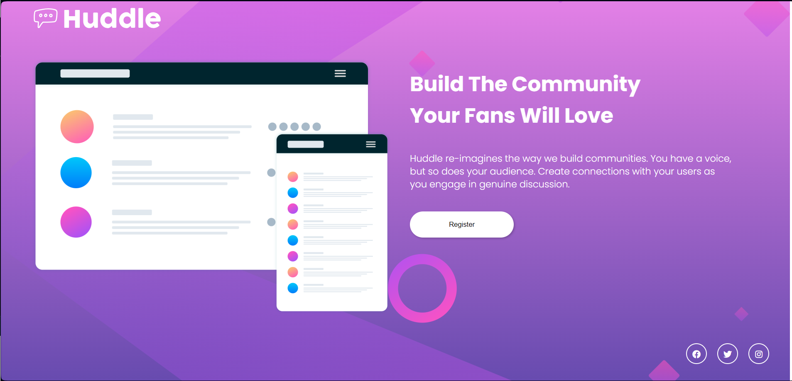

# Frontend Mentor - Solução da Quest HTML + CSS  avançado 🪓

Esta é uma solução para o [desafio de componente de resumo de resultados no Frontend Mentor](https://www.frontendmentor.io/challenges/huddle-landing-page-with-a-single-introductory-section-B_2Wvxgi0). Os desafios do Frontend Mentor ajudam você a melhorar suas habilidades de codificação, construindo projetos realistas.

## Sumário

- [Visão geral](#visão-geral)
  - [O desafio](#o-desafio)
  - [Captura de tela](#captura-de-tela)
  - [Links](#links)
  - [Meu processo](#meu-processo)
  - [Construído com](#construído-com)
  - [O que eu aprendi](#o-que-eu-aprendi)
  - [Desenvolvimento contínuo](#desenvolvimento-contínuo)
  - [Autor](#autor)

## Visão geral

### O desafio

Os usuários devem ser capazes de:

- Ver o layout ideal para a interface, dependendo do tamanho da tela do seu dispositivo
- Ver estados de hover e foco para todos os elementos interativos na página

### Captura de tela

### Links

- URL da solução: [Git Clone](https://github.com/guilherme-silvam/quest-html-css-avancado.git)
- URL do site ao vivo: [Adicione a URL do site ao vivo aqui](https://your-live-site-url.com)

## Meu processo

### Construído com

- Marcação HTML5 semântica
- Propriedades CSS personalizadas

### O que eu aprendi

Este projeto foi uma excelente oportunidade para aprimorar minhas habilidades de responsividade e para aprender mais sobre o uso do Flexbox e suas funcionalidades.Melhorei minha compreensão do Flexbox e como ele pode ser utilizado para criar layouts flexíveis e responsivos. Ao aprender a usar propriedades como flex-direction, justify-content e align-items, pude criar layouts mais dinâmicos e adaptáveis, proporcionando uma experiência mais agradável aos usuários em uma variedade de dispositivos. Essas novas habilidades serão valiosas para meus projetos futuros, permitindo-me criar designs mais eficientes e robustos.

### Desenvolvimento contínuo

Planejo continuar aprimorando minhas habilidades de desenvolvimento, especialmente em áreas específicas. Tenho o objetivo de aperfeiçoar meu conhecimento sobre técnicas de posicionamento, como o uso do flexbox e do grid, para criar layouts mais flexíveis, eficientes e dinâmicos. Além disso, pretendo concentrar meus esforços em melhorar ainda mais a responsividade dos meus projetos, garantindo uma experiência perfeita em uma ampla variedade de dispositivos e tamanhos de tela. Estou animado para explorar mais a fundo o grid CSS e suas capacidades, pois sei que isso me ajudará a criar layouts mais complexos e sofisticados de forma mais eficiente. Com esses objetivos em mente, estou confiante de que continuarei a evoluir como desenvolvedor e a entregar projetos de alta qualidade no futuro.

## Autor

- Site - [Guilherme](https://www.your-site.com)
- Frontend Mentor - [guilherme-silvam](https://www.frontendmentor.io/home)
- Github - [@guilherme-silvam](https://github.com/guilherme-silvam)
